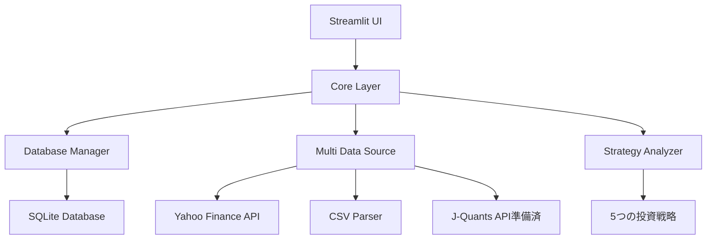

# 📊 日本株ウォッチドッグ v2.1.0

**株式市場学習・研究専用ツール（Streamlit Web版）**

[](https://github.com/inata169/J_Stock_StreamlitV2)
[](https://python.org)
[](https://streamlit.io)
[](LICENSE)

---

## 🚨 **重要：プロジェクト方針**

**このツールは学習・研究専用です** 📚
- ✅ **メイン投資**: インデックス投資(オルカン等) 90-95%
- 🧪 **このツール**: 市場理解のための学習 0%実投資
- ⚠️ **投資判断は必ずご自身の責任で行ってください**

---

## 🖥️ **対応OS**

| OS | ステータス | サポート |
|---|---|---|
| Windows 10/11 | ✅ テスト済み | フルサポート |
| macOS | 🧪 理論検証済み | コミュニティサポート |
| Linux Ubuntu | ✅ テスト済み | フルサポート |

### Mac環境について
Mac版の手順は一般的なPython/Streamlitのインストール方法に基づいて作成しています。

---

## 🚀 **インストール方法**

### 🌟 **初心者の方へ**
プログラミング未経験の方は、[📖 決定版！初心者向けインストールガイド](ultimate_install_guide.md)をご覧ください。
- 所要時間：約15-20分
- 前提知識：一切不要
- 画像付き詳細手順

### 📦 **推奨：仮想環境を使用したインストール**

仮想環境を使用することで、システムのPython環境を汚さずに安全にアプリケーションを実行できます。

#### 🪟 **Windows（推奨手順）**
```batch
# 1. プロジェクトをダウンロード
git clone https://github.com/inata169/J_Stock_StreamlitV2.git
cd J_Stock_StreamlitV2

# 2. 仮想環境を作成
python -m venv .venv

# 3. 仮想環境を有効化
.venv\Scripts\activate

# 4. 依存関係をインストール
pip install -r requirements.txt

# 5. 環境設定（オプション）
copy .env.example .env
# メモ帳で.envを編集（API制限などの設定）

# 6. アプリケーションを起動
streamlit run app.py
```

#### 🍎 **Mac（推奨手順）**
```bash
# 1. プロジェクトをダウンロード
git clone https://github.com/inata169/J_Stock_StreamlitV2.git
cd J_Stock_StreamlitV2

# 2. 仮想環境を作成
python3 -m venv .venv

# 3. 仮想環境を有効化
source .venv/bin/activate

# 4. 依存関係をインストール
pip install -r requirements.txt

# 5. 環境設定（オプション）
cp .env.example .env
# お好みのエディタで.envを編集

# 6. アプリケーションを起動
streamlit run app.py
```

#### 🐧 **Linux（推奨手順）**
```bash
# 1. 必要なパッケージをインストール
sudo apt update && sudo apt install python3 python3-pip python3-venv git -y

# 2. プロジェクトをダウンロード
git clone https://github.com/inata169/J_Stock_StreamlitV2.git
cd J_Stock_StreamlitV2

# 3. 仮想環境を作成
python3 -m venv .venv

# 4. 仮想環境を有効化
source .venv/bin/activate

# 5. 依存関係をインストール
pip install -r requirements.txt

# 6. 環境設定（オプション）
cp .env.example .env
# お好みのエディタで.envを編集

# 7. アプリケーションを起動
streamlit run app.py
```

### 📱 **クイックインストール（仮想環境なし）**

システム環境に直接インストールする場合の手順です。

#### 🪟 **Windows**
1. [Python公式サイト](https://www.python.org/downloads/)から最新版をダウンロード（**「Add Python to PATH」にチェック必須**）
2. [プロジェクトZIP](https://github.com/inata169/J_Stock_StreamlitV2/archive/refs/heads/main.zip)をダウンロード・展開
3. `Windows + R` → `cmd` → 以下を実行：
```batch
cd Desktop\J_Stock_StreamlitV2-main
pip install -r requirements.txt
streamlit run app.py
```

#### ⚡ **上級者向け1行インストール**
```bash
git clone https://github.com/inata169/J_Stock_StreamlitV2.git && cd J_Stock_StreamlitV2 && pip install -r requirements.txt && streamlit run app.py
```

### 🔧 **環境設定（オプション）**

`.env.example`ファイルを`.env`にコピーして、API制限やキャッシュ設定をカスタマイズできます：

```bash
# API制限の調整
YAHOO_API_HOURLY_LIMIT=200    # デフォルト: 100
YAHOO_API_MINUTE_LIMIT=20      # デフォルト: 10

# キャッシュ設定
ENABLE_CACHE=true              # キャッシュ有効化
CACHE_TTL=900                  # キャッシュ有効期限（秒）
```

**成功**: ブラウザで `http://localhost:8501` が自動で開きます！ 🎉

---

## 🔥 **v2.1.0 新機能**

### 🎛️ **API制限リアルタイム監視・調整**
- **サイドバー監視**: API使用状況をリアルタイム表示
- **動的制限調整**: スライドバーで1分・1時間のリクエスト制限を調整可能
- **使用率可視化**: プログレスバーとメトリクスで使用状況を把握
- **推奨設定**: 控えめ・通常・高頻度・最大性能の4プリセット

### ⚙️ **設定管理システム**
- **config.py**: API制限・キャッシュ設定の一元管理
- **.env対応**: 環境変数での設定カスタマイズ
- **プリセット機能**: 用途別の推奨設定
- **動的更新**: アプリ実行中の設定変更対応

### 📚 **開発者体験向上**
- **仮想環境対応**: venv推奨インストール手順
- **データ保存場所**: 詳細な保存先ドキュメント
- **MITライセンス**: オープンソース対応
- **GitHub準備**: パブリックリポジトリ公開準備完了

---

## 🔥 **v2.0.0 新機能**

### 🏗️ **統一データベースアーキテクチャ**
- **「両方の真実を保持」**: SBI・楽天データとYahoo Financeを透明性を持って併記
- **単位不一致問題完全解決**: 167.98% vs 0.1598の混在問題を解決
- **計算レス比較**: データベース正規化により直接比較可能
- **J-Quants準備完了**: 95%統合可能性確認済み

### 💾 **最新バグ修正（v2.0.0.1）**
- ✅ **データベーススキーマ修正**: テーブル名統一（settings→update_settings）
- ✅ **タイムゾーン対応**: 配当履歴の日時比較エラー解決
- ✅ **DataFrame互換性**: Arrow serialization対応（"N/A"→None）
- ✅ **UI改善**: 継続保有銘柄詳細表示追加
- ✅ **投資条件明確化**: 買い推奨判定基準を詳細説明

### 💼 **4つの主要機能**

#### 📊 **ポートフォリオ管理**
- **CSV自動解析**: SBI・楽天証券形式対応（32件データ処理実績）
- **リアルタイム更新**: Yahoo Finance APIによる最新株価
- **投資アドバイス**: 利確15%・損切-8%ルール
- **両方表示**: 証券会社データとAPI算出値の併記

#### 👀 **監視リスト**
- **銘柄追跡**: 気になる銘柄の自動監視
- **投資タイミング**: 5戦略による買い推奨判定
- **条件明確化**: スコア80%以上で強い買い推奨

#### 🎯 **投資戦略分析**
- **5戦略評価**: ディフェンシブ・グロース・バリュー・配当・モメンタム
- **スコア算出**: 各戦略100点満点での定量評価
- **信頼度表示**: データ品質による信頼度調整

#### 📈 **金融チャート**
- **配当利回り比較**: 複数銘柄の横並び分析
- **配当履歴**: 時系列での配当推移
- **財務レーダー**: PER・PBR・ROE・配当の総合評価

---

## 🎮 **使い方ガイド**

### 🏁 **1. 初回セットアップ（3分）**

起動後、ブラウザで以下が表示されれば成功：
- ✅ サイドバーに4つのページ（ポートフォリオ・監視リスト・戦略分析・チャート）
- ✅ 「📊 ポートフォリオ管理 v2.0.0」タイトル
- ✅ CSVファイルアップロード機能

### 📱 **2. 機能別使い方**

#### 📊 **ポートフォリオ管理**
1. **サンプルで試す**: 「📋 サンプルデータで試す」ボタンクリック
2. **実データ使用**: SBI・楽天証券のCSVをドラッグ&ドロップ
3. **分析結果**: 利確・損切アドバイスを確認
4. **データエクスポート**: サイドバーの「📄 DBからCSVエクスポート」

#### 📥 **CSVインポート手順**

**SBI証券の場合**
1. SBI証券にログイン → 「口座管理」→「口座（円建）」
2. 保有証券をクリック → 「CSVダウンロード」をクリック
3. `SaveFile.csv`というファイルがダウンロードされます
4. アプリでインポート: 「CSVインポート」タブ → ファイル選択 → 「インポート実行」

**楽天証券の場合**
1. 楽天証券にログイン → 「マイメニュー」→「資産残高・保有商品」
2. 「CSV で保存」をクリック
3. `assetbalance(all)_*.csv`というファイルがダウンロードされます
4. アプリでインポート: 自動フォーマット判定でインポート

#### 👀 **監視リスト**
1. **銘柄追加**: テキストボックスに「1928」「AAPL」等を入力
2. **クイック追加**: 「+ 積水ハウス」等のボタンクリック
3. **分析実行**: 「🔄 全更新」で最新データを取得
4. **投資判定**: 買い推奨銘柄を自動表示

#### 🎯 **戦略分析**
1. **銘柄入力**: 「1928」「7203」「AAPL」等を入力
2. **サンプル選択**: 「積水ハウス」「トヨタ」等をクリック
3. **分析結果**: 5戦略のスコアと推奨レベルを確認
4. **詳細表示**: 各戦略の満たした条件・満たさなかった条件

#### 📈 **チャート**
1. **チャート種類選択**: 配当利回り比較・配当履歴・財務レーダー
2. **銘柄選択**: 単一または複数銘柄を入力
3. **サンプルデータ**: 「日本高配当株」「米国テック株」等をクリック
4. **チャート生成**: インタラクティブグラフで詳細分析

### ⚡ **トラブルシューティング**

| 問題 | 解決方法 |
|------|----------|
| `python: command not found` | Pythonインストール確認、PATHにチェック |
| `Port 8501 already in use` | `streamlit run app.py --server.port 8502` |
| ブラウザが開かない | 手動で `http://localhost:8501` |
| API制限エラー | サイドバーで使用量確認、キャッシュクリア |
| CSV読み込みエラー | SBI・楽天証券形式確認、エンコーディング確認 |


---

## 📁 **プロジェクト構造**

```
J_Stock_StreamlitV2/
├── 🚀 app.py                          # メインアプリケーション
├── 📋 requirements.txt                # Python依存関係
├── 📖 README.md                      # ユーザーガイド（このファイル）
├── 🔧 CLAUDE.md                      # 開発者向け技術仕様書
├── 🔒 .gitignore                     # Git管理除外設定
│
├── .streamlit/                       # ⚙️ Streamlit設定
│   ├── config.toml                  # アプリ基本設定
│   └── secrets.toml.template        # 設定テンプレート
│
├── core/                            # 🏗️ v2.0.0 統一データ基盤
│   ├── database_init.py             # SQLiteデータベース初期化
│   ├── database_manager.py          # データベースアクセス層
│   ├── enhanced_csv_parser.py       # EnhancedCSVパーサー（32件処理済）
│   ├── financial_data_processor.py  # 統一データ処理層（異常値検出）
│   ├── multi_data_source.py         # マルチAPI データ取得層
│   ├── investment_strategies.py     # 5戦略分析エンジン
│   └── chart_data_manager.py        # Plotlyチャート生成層
│
├── pages/                           # 🖥️ Streamlit UI層
│   ├── portfolio.py                 # 📊 ポートフォリオ管理画面
│   ├── watchlist.py                 # 👀 監視リスト画面
│   ├── strategy.py                  # 🎯 投資戦略分析画面
│   └── charts.py                    # 📈 金融チャート画面
│
└── 📦 自動生成ファイル
    ├── stock_watchdog.db            # SQLiteデータベース
    └── cache/                       # APIキャッシュディレクトリ
```

### 🎯 **アーキテクチャ概要**



---

## 📊 **データソース**

### 🏦 **証券会社CSV（ポートフォリオデータ）**

| 証券会社 | 形式 | エンコーディング | 処理実績 |
|---------|------|----------------|----------|
| 楽天証券 | assetbalance | UTF-8/Shift_JIS | 25件 ✅ |
| SBI証券 | SaveFile | Shift_JIS | 7件 ✅ |
| **合計** | **自動判定** | **自動検出** | **32件正常処理** |

**特徴:**
- ✅ **自動フォーマット判定**: ファイル名・ヘッダーから自動識別
- ✅ **単位統一**: 損益率%値と小数値の自動変換
- ✅ **銘柄コード正規化**: "9432"→9432、9432.T→9432

### 🌐 **Yahoo Finance API（市場データ）**

```yaml
機能:
  株価データ: リアルタイム（15-20分遅れ）
  財務指標: PER・PBR・配当利回り・ROE
  配当履歴: 5-10年分（銘柄による）
  対象市場: 日本株・米国株・その他主要市場

API制限:
  時間制限: 100リクエスト/1時間
  分制限: 5リクエスト/1分
  管理方式: 適応的バックオフ + インテリジェントキャッシュ

信頼性:
  データ品質: 高（公式Yahoo Finance）
  リアルタイム性: 中（15-20分遅れ）
  カバレッジ: 全世界主要取引所
```

### 🏛️ **J-Quants API（統合準備95%完了）**

**日本取引所公式API** - 最高品質データソース

| 機能分類 | データ種類 | 統合可能性 | 実装予定 |
|----------|------------|------------|----------|
| 基本情報 | 企業情報・株価 | ✅ 100% | Phase 2 |
| 財務データ | 四半期決算 | ✅ 95% | Phase 2 |
| 市場データ | 空売り比率・信用残高 | ✅ 90% | Phase 3 |
| 投資部門 | 機関投資家売買 | ✅ 85% | Phase 3 |

### 🔤 **対応銘柄形式**

```python
# 統一銘柄コード体系
日本株:
  入力例: "9432", 9432, "9432.T", 9432.T
  正規化後: 9432  # 4桁数字統一
  
米国株:
  入力例: "AAPL", AAPL, "aapl"
  正規化後: AAPL  # 大文字統一

実例:
  1928 → 積水ハウス
  7203 → トヨタ自動車
  AAPL → Apple Inc.
  MSFT → Microsoft
```

---

## ⚙️ **設定・カスタマイズ**

### 🔧 **基本設定（自動設定済み）**

```toml
# .streamlit/config.toml（自動生成）
[server]
port = 8501
enableCORS = false

[theme]
primaryColor = "#FF6B6B"
backgroundColor = "#FFFFFF"
secondaryBackgroundColor = "#F0F2F6"
```

### 🔐 **高度設定（オプション）**

```bash
# カスタム設定が必要な場合のみ
cp .streamlit/secrets.toml.template .streamlit/secrets.toml
# 設定をカスタマイズ（通常は不要）
```

### 📊 **パフォーマンス設定**

| 設定項目 | デフォルト値 | 調整方法 |
|---------|-------------|----------|
| API制限 | 100/時間, 5/分 | サイドバーで監視 |
| キャッシュ有効期限 | 15分 | 自動最適化 |
| CSV最大サイズ | 200MB | 自動チェック |
| 同時処理銘柄数 | 10銘柄 | バッチ処理 |

---

## 💾 **データ保存場所**

### 📂 **保存データの場所**

アプリケーションで作成・保存されるデータは全てローカルPC内に保存されます：

#### 🗄️ **データベースファイル**
```
📁 プロジェクトディレクトリ/
├── stock_watchdog.db        # メインデータベース（ポートフォリオ・監視リスト）
├── j_stock_v2.db           # v2.0統一アーキテクチャ用データベース
└── data/
    └── stock_portfolio.db  # 設定でカスタマイズした場合
```

#### 📊 **CSVファイル**
```
📁 プロジェクトディレクトリ/
├── your_portfolio.csv      # アップロードしたポートフォリオCSV
└── exported_data.csv       # エクスポートしたデータ（ダウンロード）
```

#### 📝 **ログファイル**
```
📁 プロジェクトディレクトリ/
├── app.log                 # アプリケーション動作ログ
└── logs/
    ├── app.log            # 構造化ログ
    └── health_check.log   # ヘルスチェックログ
```

#### 🔄 **キャッシュ・一時ファイル**
```
📁 ホームディレクトリ/
└── .streamlit/            # Streamlitシステムキャッシュ

📁 プロジェクトディレクトリ/
├── __pycache__/          # Pythonキャッシュ（自動生成）
└── .venv/                # 仮想環境（推奨インストール時）
```

### 🔧 **データ管理のヒント**

| 操作 | 方法 | 注意点 |
|------|------|--------|
| **データバックアップ** | `*.db`ファイルをコピー | 定期的なバックアップ推奨 |
| **データリセット** | `*.db`ファイルを削除 | 全てのデータが失われます |
| **ポータブル使用** | プロジェクトフォルダごと移動 | 相対パスで設計済み |
| **データエクスポート** | アプリ内のエクスポート機能使用 | CSV形式でダウンロード可能 |

### 📍 **データ場所の確認方法**

```bash
# データベースファイルの確認
find . -name "*.db" -maxdepth 2

# ログファイルの確認  
find . -name "*.log" -maxdepth 2

# CSVファイルの確認
find . -name "*.csv" -maxdepth 2 | grep -v ".venv"
```

**重要**: 全てのデータはローカルPC内に保存され、外部サーバーには一切送信されません。

---

## 🛡️ **セキュリティ・プライバシー**

### 🔒 **プライバシー保護**
- ✅ **ローカル実行**: 全データが自分のPC内で処理
- ✅ **外部送信なし**: 個人情報・投資情報の外部流出なし
- ✅ **自動削除**: 一時ファイルは自動クリーンアップ
- ✅ **認証不要**: Yahoo Finance APIは無料・認証不要

### 🛡️ **データ安全管理**
```yaml
暗号化: SQLiteデータベース（必要に応じて）
アクセス制御: ローカル実行のみ
ログ管理: 個人情報を含まない技術ログのみ
バックアップ: ユーザー管理（推奨: CSV エクスポート）
```

---

## 🆘 **サポート・コミュニティ**

### 📋 **問題報告**
1. **GitHub Issues**: [報告・要望受付](https://github.com/inata169/J_Stock_StreamlitV2/issues)
2. **バグ報告時の必要情報**:
   - OS（Windows/Mac/Linux）
   - Python バージョン
   - エラーメッセージ全文
   - 再現手順

### 💬 **コミュニティ**
- **開発者向け**: `CLAUDE.md` 参照
- **技術仕様**: アーキテクチャ・実装詳細
- **コントリビューション**: Pull Request歓迎

### 🔄 **開発参加**

```bash
# 開発環境セットアップ
git clone https://github.com/inata169/J_Stock_StreamlitV2.git
cd J_Stock_StreamlitV2
python -m venv .venv
source .venv/bin/activate  # Linux/Mac
pip install -r requirements.txt

# コードスタイル
black . && flake8 .

# テスト実行（準備中）
pytest tests/
```

**コーディング規約**:
- ✅ UTF-8エンコーディング
- ✅ 統一キー使用義務（dividend_yield等）
- ✅ 生データ直接アクセス禁止
- ✅ エラーハンドリング必須

---

## 📈 **バージョン履歴**

### 🎯 **v2.0.0.1（最新）- 重要バグ修正**
*2025年1月リリース*

#### 🔧 **修正内容**
- ✅ **データベーススキーマ修正**: settings→update_settings、financial_metrics→financial_indicators
- ✅ **タイムゾーン対応**: 配当履歴の日時比較エラー解決
- ✅ **DataFrame互換性**: Arrow serialization対応（"N/A"→None）
- ✅ **UI改善**: 継続保有銘柄詳細表示、投資アドバイス強化
- ✅ **投資条件明確化**: 買い推奨判定基準（80%以上で強い買い）詳細説明
- ✅ **JSON処理強化**: DecimalJSONEncoder実装で数値精度向上

#### 🎯 **動作確認済み**
- ✅ 全コアモジュール正常インポート
- ✅ 5戦略分析システム（ディフェンシブ・グロース・バリュー・配当・モメンタム）
- ✅ 銘柄コード正規化（"9432"→9432、9432.T→9432）
- ✅ JSON serialization（Decimal対応）

### 🏗️ **v2.0.0 - 統一データベースアーキテクチャ**
*2024年12月リリース*

#### 🔥 **画期的新機能**
- 🏗️ **「両方の真実保持」**: SBI167.98% vs Yahoo0.1598の単位不一致問題完全解決
- 📊 **EnhancedCSVParser**: 楽天25件+SBI7件=32件データ正常処理実績
- ⚡ **適応的API制限管理**: Yahoo Finance 100req/h、バックオフ制御
- 🎯 **銘柄コード統一**: 4桁数字形式（.T除去）、小数点1桁精度
- ✅ **J-Quants統合準備**: 95%適合性確認、Phase2実装予定
- 🗄️ **SQLiteデータベース**: 5テーブル構成、永続化ストレージ

#### 🎯 **5戦略分析システム**
- **ディフェンシブ**: 配当(30pt)+PER(25pt)+PBR(25pt)+ROE(20pt)
- **グロース**: ROE(40pt)+成長性(30pt)+PER許容度(30pt)
- **バリュー**: PER(40pt)+PBR(40pt)+価格妥当性(20pt)
- **配当**: 配当利回り(50pt)+継続性(30pt)+安定性(20pt)
- **モメンタム**: 価格動向(50pt)+出来高(30pt)+センチメント(20pt)

### 📊 **v0.3.0 - 統一データ処理**
- 🎯 統一データ処理アーキテクチャ
- 📊 異常値検出・自動修正（配当利回り477%→4.77%）
- 🛡️ 3段階警告システム（軽微・注意・重大）
- ✅ 実銘柄検証（積水ハウス・トヨタ・ソニー他）

### 🔧 **v0.2.2 - バグ修正**
- 🔥 配当利回り計算バグ修正
- 🛡️ 財務指標異常値検出強化
- 🔧 Yahoo Finance API対応改善

### 🚀 **v0.1.0 - 初期リリース**
- 📱 Streamlit Web版
- 💼 ポートフォリオ管理
- 👀 監視リスト機能

---

## 🔮 **ロードマップ**

### 🎯 **Phase 2（2025年Q2）: J-Quants統合**
**準備完了度: 95%** ✅

```yaml
実装予定:
  J-Quants API: 日本取引所公式データ統合
  四半期財務: 決算トレンド分析
  市場センチメント: 空売り比率・信用残高
  
統合可能性:
  基本情報: 100% ✅ (企業情報・株価)
  財務データ: 95% ✅ (四半期決算)
  市場データ: 90% ✅ (空売り・信用)
  投資部門: 85% ✅ (機関投資家)
```

### 🚀 **Phase 3（2025年Q3-Q4）: 高度分析**

```yaml
分析機能:
  機関投資家動向: 投資部門別売買分析
  決算スケジュール: 発表日程連携
  投資タイミング: ML・統計的最適化
  
UI/UX改善:
  ダッシュボード: 統合分析画面
  アラート機能: 条件通知システム
  モバイル対応: レスポンシブデザイン
```

### 🌟 **Future Vision**
- **🤖 AI分析**: 機械学習による投資提案
- **📊 リアルタイム**: WebSocket でリアルタイム価格
- **🌐 グローバル**: 世界市場対応
- **📱 アプリ化**: モバイルアプリ版

---

## 🎯 **プロジェクト哲学**

### 💡 **学習第一主義**

```yaml
投資スタンス:
  メイン投資: インデックス投資 90-95% (オルカン・S&P500等)
  このツール: 学習・研究用 0%実投資
  
学習目標:
  金融知識: 企業分析・投資理論・市場メカニズム
  技術スキル: Python・データベース・API・Web開発
  実践経験: データ分析・可視化・システム設計
```

### 🏗️ **v2.0設計思想**

#### 🔍 **透明性**
- **「両方の真実を保持」**: データソース間の差異を隠さず明示
- **計算過程の可視化**: どこからどんなデータが来ているかを明確化
- **警告システム**: データ品質問題を3段階で通知

#### 🎯 **正確性**
- **単位不一致の完全解決**: 167.98% vs 0.1598の混在問題を根本解決
- **異常値自動検出**: 配当利回り477%→4.77%等の自動修正
- **データ検証**: 入力から表示まで全段階での整合性チェック

#### 🚀 **拡張性**
- **J-Quants統合基盤**: 95%準備完了の統合基盤
- **モジュラー設計**: 新機能追加が容易な構造
- **API抽象化**: 複数データソースの統一インターフェース

#### 📚 **学習価値**
- **実践的スキル習得**: データベース設計・API管理・Web開発
- **金融知識の深化**: 企業分析・投資戦略・リスク管理
- **オープンソース貢献**: GitHubでの共同開発経験

---

## ⚠️ **免責事項・利用規約**

### 🚨 **重要な注意事項**

```
⚠️ 教育・学習専用ツール
   投資判断は必ずご自身の責任で行ってください
   
⚠️ データ精度について
   Yahoo Finance APIの遅延（15-20分）があります
   証券会社データとAPI データに差異が生じる場合があります
   
⚠️ 投資リスクについて
   株式投資は元本割れのリスクがあります
   過去の実績は将来の成果を保証するものではありません
```

### 📋 **利用条件**
- ✅ **学習・研究目的の利用**: 歓迎
- ✅ **個人利用**: 自由に利用可能
- ✅ **コードの改変・再配布**: MIT License準拠
- ❌ **商用利用**: 事前相談必須
- ❌ **投資助言**: このツールは投資助言業務ではありません

### 🏛️ **ライセンス**
**MIT License** - 詳細は [LICENSE](LICENSE) ファイルを参照

---

## 🎉 **謝辞**

このプロジェクトは以下の優れたオープンソースプロジェクトの上に成り立っています：

- **[Streamlit](https://streamlit.io/)** - 美しいWebアプリフレームワーク
- **[yfinance](https://github.com/ranaroussi/yfinance)** - Yahoo Finance API ラッパー
- **[Plotly](https://plotly.com/)** - インタラクティブ可視化ライブラリ
- **[Pandas](https://pandas.pydata.org/)** - データ分析基盤
- **[SQLite](https://sqlite.org/)** - 軽量データベース

**開発者・コントリビューターの皆様に感謝いたします** 🙏

---

<div align="center">

**📊 J_Stock_StreamlitV2 v2.0.0.1**

*合理的投資 × 実践的学習 = 持続的成長*

[](https://github.com/inata169/J_Stock_StreamlitV2/stargazers)
[](https://github.com/inata169/J_Stock_StreamlitV2/network)

[🚀 今すぐ始める](#🚀-超簡単インストール) | [📚 使い方ガイド](#🎮-使い方ガイド) | [🔧 開発参加](#🆘-サポート・コミュニティ)

</div>